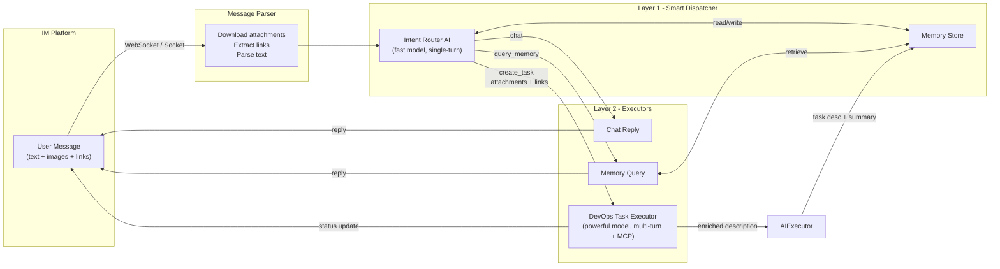
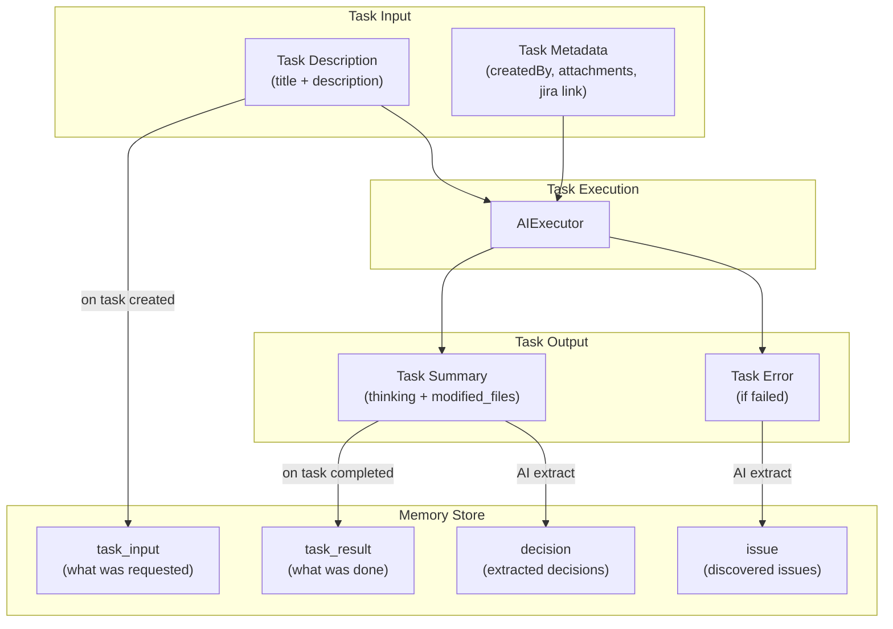

# DevOps Bot

Chat-driven AI coding agent — discuss requirements in group chat, get automated code changes and pull requests.

Supports multiple AI providers (Anthropic, OpenAI, and any OpenAI-compatible API) and multiple IM platforms (Feishu/Lark, Slack).

## Architecture

### System Overview



### Memory Feedback Loop



## Features

- **Multi-provider AI**: Anthropic (Claude), OpenAI, or any OpenAI-compatible API (DeepSeek, Groq, Together, etc.)
- **Multi-platform IM**: Feishu/Lark (WebSocket) or Slack (Socket Mode) — no public IP needed
- **Two-Layer AI**: Fast model routes intents, powerful model executes tasks — cost optimized
- **Project Memory**: AI remembers decisions, context, and past work
- **Sandbox Execution**: Tasks run in isolated Git worktree sandboxes, changes submitted as Draft PRs
- **Task Queue**: FIFO queue ensures one task runs at a time
- **Jira Integration**: Auto-fetch issue details when Jira link detected
- **Figma Integration**: Fetch design context from Figma links
- **File Attachments**: Screenshots and files from IM messages are passed to Task AI

## Quick Start

### Option 1: One-line Install (Recommended)

```bash
curl -fsSL https://raw.githubusercontent.com/xxxxxccc/devops-bot/main/install.sh | bash
```

The installer will:
- Download the latest pre-built release from GitHub
- Detect your runtime (Node.js ≥ 18 or Bun)
- Guide you to configure AI provider, project path, and IM platform
- Optionally configure Jira, Figma, and local vector search
- Set up `devops-bot` command globally

Then start:
```bash
devops-bot start
```

Upgrade anytime:
```bash
devops-bot upgrade
```

### Option 2: Manual Install (Development)

```bash
git clone https://github.com/xxxxxccc/devops-bot.git
cd devops-bot
pnpm install
cp .env.example .env.local
```

Edit `.env.local`:

```env
# Target project path (the codebase AI will work on)
TARGET_PROJECT_PATH=/path/to/your/project

# AI provider: anthropic | openai (default: anthropic)
# AI_PROVIDER=anthropic
AI_API_KEY=your-api-key

# IM platform: feishu | slack (default: feishu)
# IM_PLATFORM=feishu

# Feishu
FEISHU_APP_ID=your-feishu-app-id
FEISHU_APP_SECRET=your-feishu-app-secret

# Or Slack
# SLACK_BOT_TOKEN=xoxb-...
# SLACK_APP_TOKEN=xapp-...
```

Build and start:
```bash
pnpm build
pnpm start
```

### Prerequisites

1. **AI API Key** — pick one:
   - [Anthropic Console](https://console.anthropic.com/) for Claude models
   - [OpenAI Platform](https://platform.openai.com/api-keys) for GPT models
   - Any OpenAI-compatible endpoint (DeepSeek, Groq, Together, etc.) via `AI_BASE_URL`

2. **IM Platform** — pick one:
   - **Feishu/Lark**: Create app at https://open.feishu.cn/app → Enable Long Connection → Add `im.message.receive_v1` event
   - **Slack**: Create app at https://api.slack.com/apps → Enable Socket Mode → Subscribe to message events

### CLI Commands

```bash
devops-bot start            # Start the server (IM bot auto-connects)
devops-bot start -p 8080    # Custom port
devops-bot --project /path  # Specify project path
devops-bot tools            # List available MCP tools
devops-bot mcp              # Start MCP server (stdio)
devops-bot setup-embedding  # Install local embedding model for vector search
devops-bot upgrade          # Upgrade to latest version
devops-bot migrate-tasks    # Import legacy tasks.json into memory
devops-bot --help           # Show help
```

## How It Works

1. **Send a message** in your IM group chat (e.g., "Fix the timezone display bug in settings")
2. **Layer 1 (Dispatcher)** classifies intent → routes to task creation
3. **Layer 2 (Task AI)** analyzes code, makes changes in a sandbox, runs checks
4. **Task complete** → IM receives summary with modified files, Draft PR created

The system remembers past decisions, user preferences, and task history for context.

## API Reference

All write APIs require auth header:

```bash
secret: your-secret-key
# or
Authorization: Bearer your-secret-key
```

### Health Check
```bash
GET /health
```

### SSE
```bash
GET /events
POST /watch
```

### Submit Task (API)
```bash
POST /task
Content-Type: application/json

{
  "title": "Fix timezone display bug",
  "task": "The timezone shows Belize instead of Chicago..."
}
```

### Get Task
```bash
GET /task/:id
```

### List Tasks
```bash
GET /tasks
```

### Update / Delete Task
```bash
PATCH /task/:id
DELETE /task/:id
```

### Task Actions
```bash
POST /task/:id/retry
POST /task/:id/stop
POST /task/:id/continue
```

### Upload Attachments
```bash
POST /upload
Content-Type: multipart/form-data
```

### Other Endpoints
```bash
GET /tools
POST /webhook/todo
```

## MCP Tools

| Category | Tools |
|----------|-------|
| **File** | `read_file`, `write_file`, `edit_file`, `delete_file`, `list_directory` |
| **Search** | `glob_search`, `grep_search` |
| **Git** | `git_status`, `git_diff`, `git_log`, `git_show`, `git_branch`, `git_checkout_branch`, `git_switch`, `git_add`, `git_commit`, `git_push`, `git_pull`, `git_stash` |
| **Shell** | `shell_exec`, `shell_stream`, `npm` |
| **Task** | `submit_summary`, `get_task_history` |
| **Jira** | `jira_get_issue`, `jira_search`, `jira_add_comment`, `jira_update_issue` (when configured) |
| **Figma** | `get_design_context`, `get_screenshot`, `get_metadata`, `get_variable_defs` (when configured) |

## Project Structure

```
devops-bot/
├── src/
│   ├── index.ts              # Entry point, CLI commands
│   ├── providers/
│   │   ├── types.ts          # AIProvider interface, neutral message types
│   │   ├── anthropic.ts      # Anthropic (Claude) adapter
│   │   ├── openai.ts         # OpenAI / compatible API adapter
│   │   └── index.ts          # Provider factory
│   ├── channels/
│   │   ├── types.ts          # IMPlatform interface, neutral message types
│   │   ├── feishu/           # Feishu/Lark adapter (WebSocket, parser, types)
│   │   ├── slack/            # Slack adapter (Socket Mode, Block Kit)
│   │   └── index.ts          # Platform factory
│   ├── agent/
│   │   ├── ai-executor.ts    # Provider-agnostic AI executor with MCP
│   │   └── create-executor.ts # Executor factory
│   ├── dispatcher/
│   │   ├── index.ts          # Layer 1 orchestrator (platform-agnostic)
│   │   ├── ai-client.ts      # Dispatcher model call + tool loop
│   │   ├── prompt.ts         # Dispatcher prompt builder
│   │   ├── tools.ts          # Read-only dispatcher tools
│   │   └── config.ts         # Dispatcher memory config
│   ├── memory/
│   │   ├── store.ts          # SQLite-backed memory + JSONL export
│   │   ├── db.ts             # SQLite schema and queries
│   │   ├── search.ts         # Hybrid search (vector + keyword)
│   │   ├── embedding.ts      # Embedding provider integration
│   │   ├── extractor.ts      # AI-powered memory extraction
│   │   ├── retriever.ts      # Memory retrieval pipeline
│   │   ├── dedup.ts          # Memory dedup/reinforcement logic
│   │   └── types.ts          # Memory type definitions
│   ├── webhook/
│   │   ├── server.ts         # Webhook server composition
│   │   ├── routes.ts         # Express route handlers
│   │   ├── task-runner.ts    # Task queue + execution
│   │   ├── sse.ts            # SSE client manager
│   │   └── prompt.ts         # Layer 2 prompt builder
│   ├── sandbox/
│   │   ├── manager.ts        # Git worktree sandbox lifecycle
│   │   └── pr-creator.ts     # Auto PR/MR creation (GitHub/GitLab)
│   ├── mcp/
│   │   └── server.ts         # MCP server for AI tools
│   ├── tools/
│   │   ├── file-tools.ts     # File operations
│   │   ├── git-tools.ts      # Git operations
│   │   ├── shell-tools.ts    # Shell commands
│   │   ├── skill-tools.ts    # Skill management (find/install/create)
│   │   └── summary-tool.ts   # AI summary submission
│   ├── prompt/               # Project/rules/skills scanner
│   ├── core/
│   │   ├── task-store.ts     # JSON-based task persistence
│   │   ├── registry.ts       # MCP tool registry
│   │   ├── tool-policy.ts    # Tool policy and grouping
│   │   └── types.ts          # TypeScript types
│   └── infra/                # Logger, retry helpers
├── skills/                   # Bundled skills for Task AI executor
├── models/                   # Local embedding models (optional)
├── data/
│   ├── tasks.json            # Task storage
│   ├── memory/
│   │   ├── index.sqlite      # Memory primary storage
│   │   ├── *.jsonl           # Memory exports for AI browsing
│   │   └── conversations/    # Conversation JSONL by month
│   └── attachments/          # Uploaded/downloaded files
└── .env.local                # Configuration
```

## Safety

- Dangerous shell commands are blocked (`rm -rf /`, `sudo`, etc.)
- Task execution runs in isolated Git worktree sandboxes
- Changes are submitted as Draft PRs for human review
- Protected branches cannot be force-pushed
- Cost-optimized: fast model for routing, powerful model for execution

## Contributing

See [CONTRIBUTING.md](CONTRIBUTING.md) for guidelines.

## License

[MIT](LICENSE)
