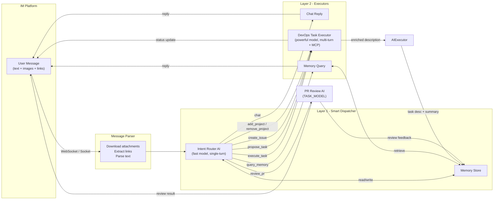
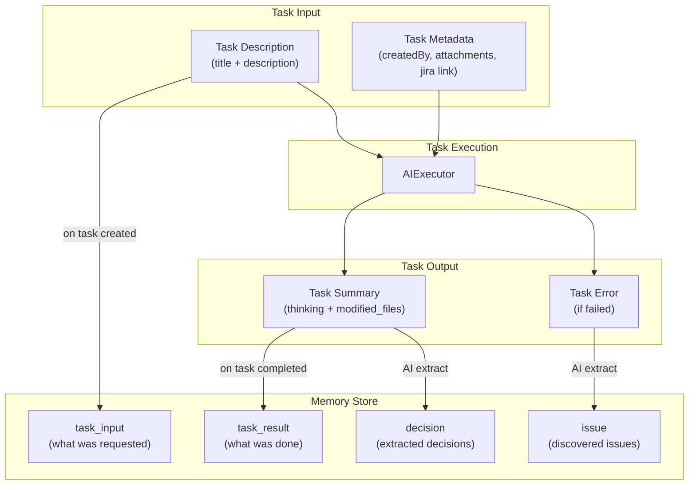
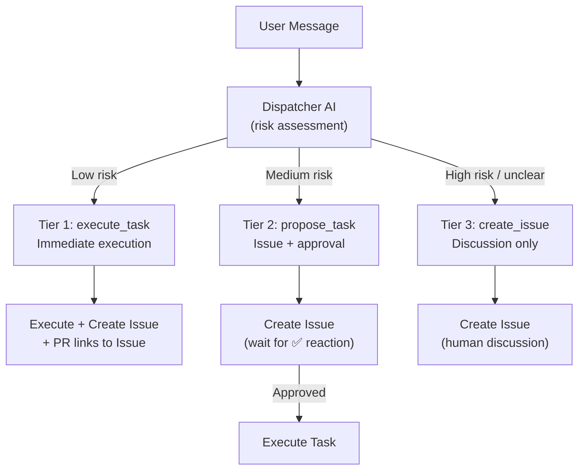

# DevOps Bot

[](LICENSE)
[](https://github.com/xxxxxccc/devops-bot/actions/workflows/pr-check.yml)
[](https://github.com/xxxxxccc/devops-bot/actions/workflows/release.yml)

Chat-driven AI coding agent — discuss requirements in group chat, get automated code changes and pull requests.

Supports multiple AI providers (Anthropic, OpenAI, and any OpenAI-compatible API) and multiple IM platforms (Feishu/Lark, Slack).

## Architecture

### System Overview


```mermaid
flowchart LR
    subgraph im [IM Platform]
        Msg["User Message\n(text + images + links)"]
    end

    subgraph parse [Message Parser]
        Parser["Download attachments\nExtract links\nParse text"]
    end

    subgraph layer1 [Layer 1 - Smart Dispatcher]
        Router["Intent Router AI\n(fast model, single-turn)"]
        Memory["Memory Store"]
    end

    subgraph layer2 [Layer 2 - Executors]
        ChatReply["Chat Reply"]
        MemoryQuery["Memory Query"]
        TaskExec["DevOps Task Executor\n(powerful model, multi-turn + MCP)"]
    end

    Msg -->|"WebSocket / Socket"| Parser
    Parser --> Router
    Router -->|"chat"| ChatReply
    Router -->|"query_memory"| MemoryQuery
    Router -->|"execute_task"| TaskExec
    Router -->|"propose_task"| TaskExec
    Router -->|"create_issue"| TaskExec
    Router -->|"review_pr"| ReviewAI["PR Review AI\n(TASK_MODEL)"]
    Router -->|"add_project / remove_project"| TaskExec
    Router <-->|"read/write"| Memory
    MemoryQuery <-->|"retrieve"| Memory
    TaskExec -->|"enriched description"| Executor["AIExecutor"]
    ChatReply -->|"reply"| Msg
    MemoryQuery -->|"reply"| Msg
    TaskExec -->|"status update"| Msg
    Executor -->|"task desc + summary"| Memory
    ReviewAI -->|"review result"| Msg
    ReviewAI -->|"review feedback"| Memory
```

### Memory Feedback Loop


```mermaid
flowchart TB
    subgraph input [Task Input]
        TaskDesc["Task Description\n(title + description)"]
        TaskMeta["Task Metadata\n(createdBy, attachments, jira link)"]
    end

    subgraph exec [Task Execution]
        AI["AIExecutor"]
    end

    subgraph output [Task Output]
        Summary["Task Summary\n(thinking + modified_files)"]
        Error["Task Error\n(if failed)"]
    end

    subgraph memory [Memory Store]
        TaskInput_Mem["task_input\n(what was requested)"]
        TaskResult_Mem["task_result\n(what was done)"]
        Decision_Mem["decision\n(extracted decisions)"]
        Issue_Mem["issue\n(discovered issues)"]
    end

    TaskDesc --> AI
    TaskMeta --> AI
    AI --> Summary
    AI --> Error

    TaskDesc -->|"on task created"| TaskInput_Mem
    Summary -->|"on task completed"| TaskResult_Mem
    Summary -->|"AI extract"| Decision_Mem
    Error -->|"AI extract"| Issue_Mem
```

## Three-Tier Task Execution

The dispatcher AI assesses risk level and routes tasks through three tiers:


```mermaid
flowchart TD
  msg["User Message"] --> ai["Dispatcher AI\n(risk assessment)"]
  ai -->|"Low risk"| tier1["Tier 1: execute_task\nImmediate execution"]
  ai -->|"Medium risk"| tier2["Tier 2: propose_task\nIssue + approval"]
  ai -->|"High risk / unclear"| tier3["Tier 3: create_issue\nDiscussion only"]

  tier1 --> exec1["Execute + Create Issue\n+ PR links to Issue"]
  tier2 --> issue2["Create Issue\n(wait for ✅ reaction)"]
  issue2 -->|"Approved"| exec2["Execute Task"]
  tier3 --> issue3["Create Issue\n(human discussion)"]
```

### Tier 1: `execute_task` (Low Risk)

Executes immediately without human approval. Best for:
- Copy/text updates, config tweaks
- Simple bug fixes with clear scope
- Style adjustments, typo fixes

An Issue is auto-created for tracking, and the resulting PR links to it.

### Tier 2: `propose_task` (Medium Risk)

Creates an Issue and waits for approval before executing. A background poller checks for approval reactions (`+1`, `heart`, or `hooray`) every 30 minutes (configurable via `APPROVAL_POLL_INTERVAL_MS`). When approved, an independent **Issue AI** (using the Dispatcher model) reads the full issue discussion and synthesizes a clear, actionable task description -- filtering out meta-discussion and focusing on the latest consensus. The synthesized task is then executed by the Task AI. Used for:
- New features
- Refactoring across multiple files
- Adding dependencies
- Multi-module changes

### External Issue Support

The poller also scans all registered projects for open issues labeled `devops-bot` (configurable via `ISSUE_SCAN_LABELS`). Any issue with an approval reaction is processed by the Issue AI the same way. This means users can create issues directly on GitHub/GitLab, label them, and approve them -- no chat interaction required. The bot posts a comment on the issue when execution starts or when it determines the issue is not feasible for automated execution.

### Tier 3: `create_issue` (High Risk / Unclear)

Creates an Issue for discussion only — no automatic execution. Used for:
- Architecture changes
- Vague or open-ended requests
- Data migrations
- Breaking API changes

### Risk Assessment Criteria

The AI evaluates:
- **Specificity**: Is it clear exactly what to change?
- **Scope**: How many files/modules are affected?
- **Reversibility**: Can it be easily reverted?
- **Breaking potential**: Could it break existing functionality?
- **Design decisions**: Are there multiple valid approaches?

## PR Review

AI-powered code review that provides both high-level summary and line-level comments on pull requests. Uses the `TASK_MODEL` for review analysis.

### Trigger Modes

| Trigger | How it works | IM Notification |
|---------|-------------|-----------------|
| **Self-review** | Automatically reviews bot-created PRs after task completion (`ENABLE_SELF_REVIEW=true`) | Yes (originating chat) |
| **IM command** | User sends "review PR #123" in chat → `review_pr` intent | Yes (originating chat) |
| **Polling** | Background poller scans registered projects for open PRs (`REVIEW_TRIGGER_MODE=poll`) | No (GitHub PR comment only) |
| **Webhook** | GitHub webhook on PR open/update (`REVIEW_TRIGGER_MODE=webhook`) | No (GitHub PR comment only) |

### Memory Isolation

Review memories are stored in a separate `review` namespace to avoid polluting task context. Two review-specific memory types are used:

- **`review_feedback`** — per-PR review results
- **`review_pattern`** — recurring patterns extracted across reviews

When `ENABLE_REVIEW_CROSS_INJECT=true`, `review_pattern` memories are selectively injected into task dispatcher context, creating a feedback loop where common review findings improve future code generation.

## Features

- **Multi-provider AI**: Anthropic (Claude), OpenAI, or any OpenAI-compatible API (DeepSeek, Groq, Together, etc.)
- **Multi-platform IM**: Feishu/Lark (WebSocket) or Slack (Socket Mode) — no public IP needed
- **Two-Layer AI**: Fast model routes intents, powerful model executes tasks — cost optimized
- **Project Memory**: AI remembers decisions, context, and past work
- **Sandbox Execution**: Tasks run in isolated Git worktree sandboxes, changes submitted as Draft PRs
- **Parallel Execution**: Per-project serial, cross-project parallel task execution (configurable concurrency)
- **Multi-Project**: Manage multiple git repositories from a single chat group
- **GitHub App Auth**: Secure authentication via GitHub App (replaces PAT)
- **Three-Tier Tasks**: AI-driven risk assessment routes tasks through execute/propose/issue tiers
- **PR Review**: AI code review with self-review, IM command, polling, and webhook triggers
- **Jira Integration**: Auto-fetch issue details when Jira link detected
- **Figma Integration**: Fetch design context from Figma links
- **File Attachments**: Screenshots and files from IM messages are passed to Task AI

## Prerequisites

| Dependency | Required | Purpose |
|-----------|----------|---------|
| **Node.js ≥ 18** or **Bun** | Yes | Runtime environment |
| **git** | Yes | Repository management, branch/commit/push operations |
| **curl** or **wget** | Yes | Download release artifacts during install |
| **Python 3** | Recommended | Required by `node-gyp` to compile native modules (`better-sqlite3`, `node-pty`) |
| **make + gcc/g++** | Recommended | C/C++ build toolchain for native modules |

<details>
<summary>Install commands by platform</summary>

**Debian / Ubuntu**
```bash
sudo apt update && sudo apt install -y git curl python3 make g++
# Node.js (via NodeSource)
curl -fsSL https://deb.nodesource.com/setup_22.x | sudo -E bash -
sudo apt install -y nodejs
```

**RHEL / Amazon Linux**
```bash
sudo yum install -y git curl python3 make gcc-c++
# Node.js (via NodeSource)
curl -fsSL https://rpm.nodesource.com/setup_22.x | sudo bash -
sudo yum install -y nodejs
```

**macOS**
```bash
# Xcode command line tools (includes git, make, clang)
xcode-select --install
# Node.js (via Homebrew)
brew install node
```

**Any platform (via nvm)**
```bash
curl -o- https://raw.githubusercontent.com/nvm-sh/nvm/v0.40.3/install.sh | bash
nvm install 22
```
</details>

> **Note:** Pre-built binaries for native modules are bundled in release artifacts.
> Python and build tools are only needed if pre-built binaries are unavailable for your platform.

## Quick Start

### Option 1: One-line Install (Recommended)

```bash
# Interactive mode (recommended for first-time setup)
bash <(curl -fsSL https://raw.githubusercontent.com/xxxxxccc/devops-bot/main/install.sh)

# Or non-interactive (install with defaults, configure .env.local manually)
curl -fsSL https://raw.githubusercontent.com/xxxxxccc/devops-bot/main/install.sh | bash
```

> **Note:** The interactive mode (`bash <(...)`) is recommended for first-time installs,
> as it guides you through AI provider, project path, and IM platform configuration.
> The piped mode (`curl ... | bash`) will install with defaults and skip the setup wizard.

The installer will:
- Download the latest pre-built release from GitHub
- Detect your runtime (Node.js ≥ 18 or Bun)
- Guide you to configure AI provider, project path, and IM platform (interactive mode)
- Optionally configure Jira, Figma, and local vector search
- Set up `devops-bot` command globally

Then start:
```bash
devops-bot start
```

Upgrade anytime:
```bash
devops-bot upgrade
```

### Option 2: Manual Install (Development)

```bash
git clone https://github.com/xxxxxccc/devops-bot.git
cd devops-bot
pnpm install
cp .env.example .env.local
```

Edit `.env.local`:

```env
# Single-project mode (backward compatible):
# TARGET_PROJECT_PATH=/path/to/your/project

# Multi-project mode: projects added via chat ("add project <git URL>")
# No TARGET_PROJECT_PATH needed

# GitHub App (recommended for GitHub repos):
# GITHUB_APP_ID=123456
# GITHUB_APP_PRIVATE_KEY_PATH=/path/to/private-key.pem

# AI provider: anthropic | openai (default: anthropic)
# AI_PROVIDER=anthropic
AI_API_KEY=your-api-key

# IM platform: feishu | slack (default: feishu)
# IM_PLATFORM=feishu

# Feishu
FEISHU_APP_ID=your-feishu-app-id
FEISHU_APP_SECRET=your-feishu-app-secret

# Or Slack
# SLACK_BOT_TOKEN=xoxb-...
# SLACK_APP_TOKEN=xapp-...
```

Build and start:
```bash
pnpm build
pnpm start
```

### Prerequisites

1. **AI API Key** — pick one:
   - [Anthropic Console](https://console.anthropic.com/) for Claude models
   - [OpenAI Platform](https://platform.openai.com/api-keys) for GPT models
   - Any OpenAI-compatible endpoint (DeepSeek, Groq, Together, etc.) via `AI_BASE_URL`

2. **IM Platform** — pick one:
   - **Feishu/Lark**: Create app at https://open.feishu.cn/app → Enable Long Connection → Add `im.message.receive_v1` event
   - **Slack**: Create app at https://api.slack.com/apps → Enable Socket Mode → Subscribe to message events

### CLI Commands

```bash
devops-bot start            # Start the server (IM bot auto-connects)
devops-bot start -p 8080    # Custom port
devops-bot --project /path  # Specify project path
devops-bot tools            # List available MCP tools
devops-bot mcp              # Start MCP server (stdio)
devops-bot setup-embedding  # Install local embedding model for vector search
devops-bot upgrade          # Upgrade to latest version
devops-bot migrate-tasks    # Import legacy tasks.json into memory
devops-bot --help           # Show help
```

## How It Works

1. **Send a message** in your IM group chat (e.g., "Fix the timezone display bug in settings")
2. **Layer 1 (Dispatcher)** classifies intent → routes to task creation
3. **Layer 2 (Task AI)** analyzes code, makes changes in a sandbox, runs checks
4. **Task complete** → IM receives summary with modified files, Draft PR created

The system remembers past decisions, user preferences, and task history for context.

## API Reference

All write APIs require auth header:

```bash
secret: your-secret-key
# or
Authorization: Bearer your-secret-key
```

### Health Check
```bash
GET /health
```

### SSE
```bash
GET /events
POST /watch
```

### Submit Task (API)
```bash
POST /task
Content-Type: application/json

{
  "title": "Fix timezone display bug",
  "task": "The timezone shows Belize instead of Chicago..."
}
```

### Get Task
```bash
GET /task/:id
```

### List Tasks
```bash
GET /tasks
```

### Update / Delete Task
```bash
PATCH /task/:id
DELETE /task/:id
```

### Task Actions
```bash
POST /task/:id/retry
POST /task/:id/stop
POST /task/:id/continue
```

### Upload Attachments
```bash
POST /upload
Content-Type: multipart/form-data
```

### GitHub Webhook (PR Review)
```bash
POST /webhook/github
Content-Type: application/json

# Receives GitHub pull_request events (opened, synchronize)
# Requires REVIEW_TRIGGER_MODE=webhook or both
```

### Other Endpoints
```bash
GET /tools
POST /webhook/todo
```

## MCP Tools

| Category | Tools |
|----------|-------|
| **File** | `read_file`, `write_file`, `edit_file`, `delete_file`, `list_directory` |
| **Search** | `glob_search`, `grep_search` |
| **Git** | `git_status`, `git_diff`, `git_log`, `git_show`, `git_branch`, `git_checkout_branch`, `git_switch`, `git_add`, `git_commit`, `git_push`, `git_pull`, `git_stash` |
| **Shell** | `shell_exec`, `shell_stream`, `npm` |
| **Task** | `submit_summary`, `get_task_history` |
| **Jira** | `jira_get_issue`, `jira_search`, `jira_add_comment`, `jira_update_issue` (when configured) |
| **Figma** | `get_design_context`, `get_screenshot`, `get_metadata`, `get_variable_defs` (when configured) |

## Project Structure

```
devops-bot/
├── src/
│   ├── index.ts              # Entry point, CLI commands
│   ├── providers/
│   │   ├── types.ts          # AIProvider interface, neutral message types
│   │   ├── anthropic.ts      # Anthropic (Claude) adapter
│   │   ├── openai.ts         # OpenAI / compatible API adapter
│   │   └── index.ts          # Provider factory
│   ├── channels/
│   │   ├── types.ts          # IMPlatform interface, neutral message types
│   │   ├── feishu/           # Feishu/Lark adapter (WebSocket, parser, types)
│   │   ├── slack/            # Slack adapter (Socket Mode, Block Kit)
│   │   └── index.ts          # Platform factory
│   ├── agent/
│   │   ├── ai-executor.ts    # Provider-agnostic AI executor with MCP
│   │   └── create-executor.ts # Executor factory
│   ├── dispatcher/
│   │   ├── index.ts          # Layer 1 orchestrator (platform-agnostic)
│   │   ├── ai-client.ts      # Dispatcher model call + tool loop
│   │   ├── prompt.ts         # Dispatcher prompt builder
│   │   ├── tools.ts          # Read-only dispatcher tools
│   │   └── config.ts         # Dispatcher memory config
│   ├── memory/
│   │   ├── store.ts          # SQLite-backed memory + JSONL export
│   │   ├── db.ts             # SQLite schema and queries
│   │   ├── search.ts         # Hybrid search (vector + keyword)
│   │   ├── embedding.ts      # Embedding provider integration
│   │   ├── extractor.ts      # AI-powered memory extraction
│   │   ├── retriever.ts      # Memory retrieval pipeline
│   │   ├── dedup.ts          # Memory dedup/reinforcement logic
│   │   └── types.ts          # Memory type definitions
│   ├── webhook/
│   │   ├── server.ts         # Webhook server composition
│   │   ├── routes.ts         # Express route handlers
│   │   ├── task-runner.ts    # Task queue + execution
│   │   ├── sse.ts            # SSE client manager
│   │   └── prompt.ts         # Layer 2 prompt builder
│   ├── sandbox/
│   │   ├── manager.ts        # Git worktree sandbox lifecycle
│   │   ├── pr-creator.ts     # Auto PR/MR creation (GitHub/GitLab)
│   │   └── issue-creator.ts  # Auto Issue creation (GitHub/GitLab)
│   ├── review/
│   │   ├── engine.ts         # PR review orchestrator
│   │   ├── ai-client.ts      # Review AI calls (TASK_MODEL)
│   │   ├── diff-parser.ts    # Diff parsing and filtering
│   │   ├── prompt.ts         # Review prompt builder
│   │   ├── comment-builder.ts # GitHub/IM output formatting
│   │   ├── store.ts          # Reviewed PR deduplication
│   │   ├── poller.ts         # PR polling mechanism
│   │   └── types.ts          # Review type definitions
│   ├── github/
│   │   ├── app-auth.ts       # GitHub App JWT + installation token
│   │   └── client.ts         # Unified GitHub API client
│   ├── project/
│   │   ├── registry.ts       # SQLite-backed project registry
│   │   ├── repo-manager.ts   # Git clone/sync manager
│   │   └── resolver.ts       # Project resolution orchestrator
│   ├── mcp/
│   │   └── server.ts         # MCP server for AI tools
│   ├── tools/
│   │   ├── file-tools.ts     # File operations
│   │   ├── git-tools.ts      # Git operations
│   │   ├── shell-tools.ts    # Shell commands
│   │   ├── skill-tools.ts    # Skill management (find/install/create)
│   │   └── summary-tool.ts   # AI summary submission
│   ├── prompt/               # Project/rules/skills scanner
│   ├── core/
│   │   ├── task-store.ts     # JSON-based task persistence
│   │   ├── registry.ts       # MCP tool registry
│   │   ├── tool-policy.ts    # Tool policy and grouping
│   │   └── types.ts          # TypeScript types
│   └── infra/                # Logger, retry helpers
├── skills/                   # Bundled skills for Task AI executor
├── models/                   # Local embedding models (optional)
├── data/
│   ├── tasks.json            # Task storage
│   ├── memory/
│   │   ├── index.sqlite      # Memory primary storage
│   │   ├── *.jsonl           # Memory exports for AI browsing
│   │   └── conversations/    # Conversation JSONL by month
│   └── attachments/          # Uploaded/downloaded files
├── ~/.devops-bot/              # Workspace directory
│   ├── repos/                  # Managed git clones (multi-project mode)
│   ├── skills/                 # Workspace-level user skills
│   └── data/                   # Debug logs
└── .env.local                # Configuration
```

## Safety

- Dangerous shell commands are blocked (`rm -rf /`, `sudo`, etc.)
- Task execution runs in isolated Git worktree sandboxes
- Changes are submitted as Draft PRs for human review
- Protected branches cannot be force-pushed
- PR reviews use memory namespace isolation to prevent cross-contamination
- Cost-optimized: fast model for routing, powerful model for execution

## Contributing

See [CONTRIBUTING.md](CONTRIBUTING.md) for guidelines.

## License

[MIT](LICENSE)
